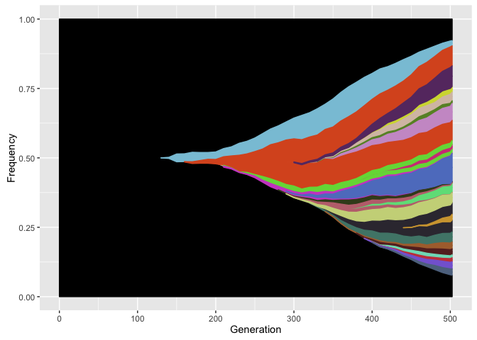

ggmuller
========

Create Muller Plots of Evolutionary Dynamics

### installation

To install & load in R with devtools:

``` r
install.packages("devtools")
library(devtools)
  
install_github("robjohnnoble/ggmuller")
library(ggmuller)
```

### usage

The main functions in `ggmuller` are `get_Muller_df` and `Muller_plot`, which we can run on some data included in the package:

``` r
# get data
Muller_df <- get_Muller_df(example_edges, example_pop_df, threshold = 0.005)

# generate pretty plot
Muller_plot(Muller_df)
```

<!-- -->
